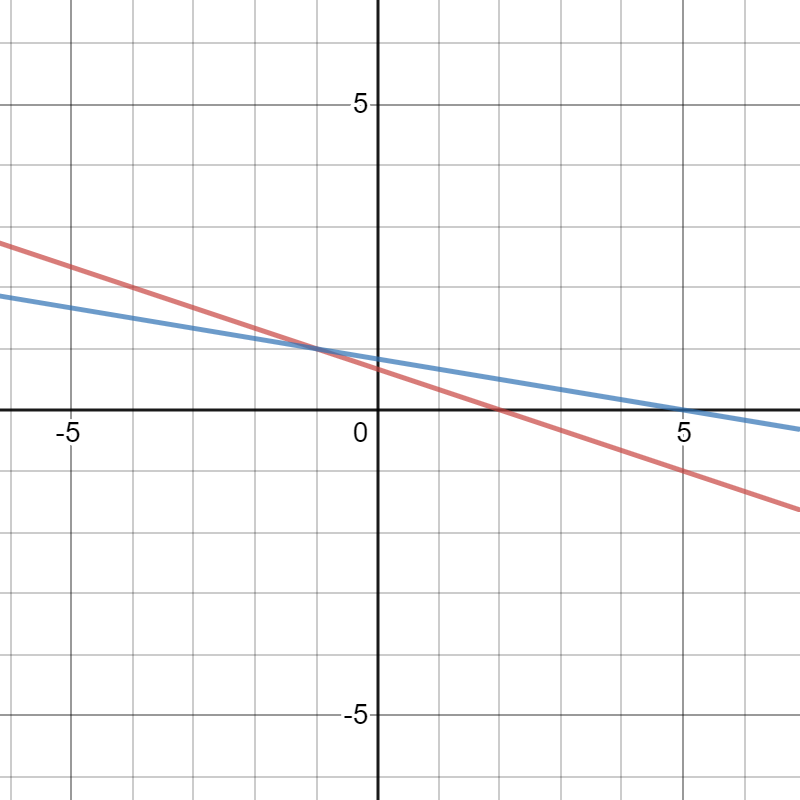

This post contains the basics of Linear Algebra for Machine Learning. This post is designed for people who want to do Machine Learning and either don't quite meet the Linear Algebra prerequisites or haven't seen Linear Algebra in a while and need a refresher.

## Linear Systems and Basic Definitions 

Linear algebra is *the study of linear equations*. Below is an example of a linear equation:

$$
a_1x_1 + a_2x_2 + \ldots + a_nx_n = y
$$

where $$x_n$$ represents input parameters and $$a_n$$ represents coefficients. Input paramaters are simply the values that get passed to a function. Coefficients are weights that scale the input parameters by some value.

If you were to plot each valid set of $$x$$ inputs given a fixed set of weights (represented by $$a_n$$) and a fixed $$y$$ value, you would find that the graph of the function results in a set of points which could all fit onto a line. Hence the name linear equation. Obviously enough, any function that does not fit onto a line is not a linear function. When an equation contains a term with a degree greater than 1 (for example $$a_nx_n^2$$ being a term of degree 2), the graph of the equation could no longer fit onto a line and the equation would be non-linear.

A system of linear equations is *a set of linear equations with respect to the same input parameters*. A set of input parameters that satisfies each equation of a system is a solution to that system. Graphically speaking, a solution refers to a point in which all the lines of a system intersect.

#### Example 1

$$
\\
1x_1 + 3x_2 = 2 \\
1x_1 + 6x_2 = 5 \\
\\
\\
x_1 = -1 \textrm{ and } x_2 = 1 
$$

In the example above, there is exactly one solution to the problem. By plotting both lines (one for each equation), you would find that the lines intersect at point (-1, 1) and only at point (-1, 1). Have a look...

 

However, systems don't always have solutions. These systems are called inconsistent. Parallel lines don't intersect and, therefore, a system of parallel lines do not have a solution. Alternatively, systems with solutions are called consistent. Consistent systems can have one solution or infinitely many solutions. 

### Scalars, Vectors, Matrices, and Tensors
Systems, inputs, and equations in Linear Algebra utilize representations that are meant to simplify Linear Algebra. Scalars, vectors, matrices, and tensors are all objects used to represent objects in Linear Algebra. 

Scalars are just single numbers. 1, 2.3, -1, 0, and 199999.9939 are scalars.

Vectors are sets of scalars. In example 1, the solution can be represented in vector form as $$x = \begin{bmatrix}-1 \\ 1\end{bmatrix}$$. Vectors are very similar to arrays found in programming languages (although the vectors defined in C++ have a different meaning).

Matrices are used to represent systems of equations, where each row corresponds to a different equation in the system and each entry of the matrix corresponds to a coefficient in that row's equation. Matrices are very similar to 2-dimensional arrays you would use in programming languages. The system in example 1 could be represented by a matrix as such:

$$
A = 
\begin{bmatrix}
  1 & 3 \\ 
  1 & 6 
\end{bmatrix}
$$

Lastly, there are tensors. Tensors are the generalization of all these objects. A tensor of rank 2 is a matrix and a tensor of rank 1 is a vector. There do exists more nuances to the word, but this definition is sufficient.

### The Matrix Equation
And... that brings us to the infamous matrix equation, which conventionally gets represented as:

$$
Ax = b
$$

where $$A$$ is the matrix of a system, $$x$$ is the vector of input parameters, and $$b$$ is the solution vector. This mapping of $$x$$ to $$b$$ through application of $$A$$ is called a **linear transformation**. A linear transformation in Linear Algebra occurs whenever you apply a linear system to an object (an object can be a vector, matrix, or tensor). Some examples of transformations to objects include scaling and shear.

## Matrix Operations

Now that we've laid out the foundation to Linear Algebra, let's describe how some operations among objects like matrices and vectors occur. Like normal operations between scalar values, matrices can be added, multiplied, inverted (though not all can be inverted), and exponentiated. Matrix operations are really important in understanding Machine Learning.

For addition between tensors, the sizes of the operands must be the same. Simply put, the sum of two tensors is a tensor of the same size as the operands (the tensors being added), with each entry being the the sum of the corresponding entries in the two tensors.

For multiplication, I will just link [a great vizualization](http://matrixmultiplication.xyz/) since it will be more clear than words in my opinion. The only thing I should add is that the number of rows in the first matrix must be equal to the number of columns in the second matrix.
